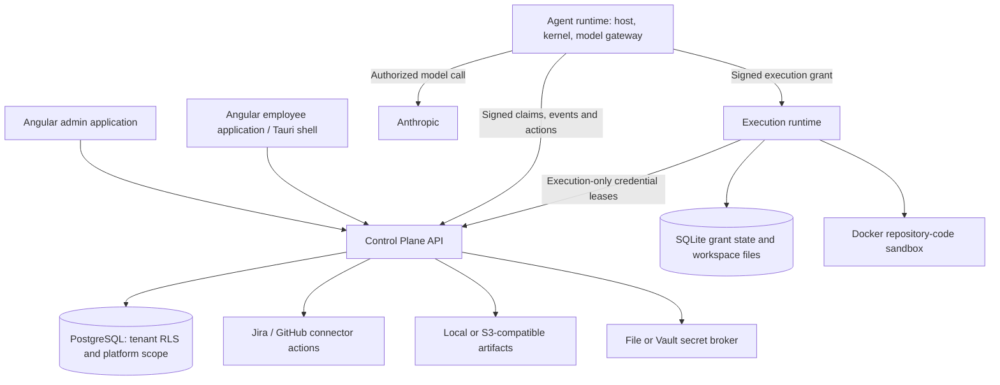

# Agents Foundry platform documentation

Agents Foundry assigns AI agents to employees within an organization's structure. The platform records who owns an agent, which versioned capabilities it receives, what work it performs and which actions require human approval. An organizational job role is distinct from an administrator's security role.

This repository is the technical knowledge base for developers, administrators, employees, operators, security reviewers and implementation partners. It documents current code and identifies architecture gaps separately. It does not treat the public website or a declarative manifest field as evidence of an implemented capability.

**Verified implementation:** `employee-agent-platform@9e7ec4eba0eeddb0fdb86c18740a1c1a610146a4`, inspected 2026-10-03. See [provenance and verification](docs/reference/provenance.md) and the [implementation matrix](docs/reference/implementation-status.md).

## Architecture at a glance



The monorepo contains five applications and shared contracts/catalog/policy/telemetry packages. The control plane authorizes work; the agent runtime requests actions; the execution runtime verifies grants before operating on repositories, files, commands or browser tests. External connector writes are dispatched centrally. The employee application polls records rather than receiving model-token streaming.

Five engineering role identities and seven blueprint versions exist. Generic execution and V2 issuance are opt-in. MCP execution, executable skill packages, employee BYOK, a packaged desktop installer and a cloud deployment stack are not implemented. [Status and gaps](docs/reference/implementation-status.md) make these boundaries explicit.

## Choose your starting point

| Reader | Start | Continue |
| --- | --- | --- |
| New reader / architect | [Platform introduction](docs/getting-started/introduction.md) | [Repository map](docs/reference/repository-map.md), [architecture](docs/architecture/overview.md), [domain model](docs/architecture/domain-model.md) |
| Developer | [Local development](docs/developer/local-development.md) | [Extension guide](docs/developer/extending-the-platform.md), [API](docs/api/README.md), [validated examples](examples/README.md) |
| Administrator / organization owner | [Setup journey](docs/admin/setup.md) | [People and roles](docs/admin/organization-and-people.md), [assignments](docs/admin/agent-assignments.md), [policies](docs/admin/policies-and-approvals.md) |
| Employee | [Workspace guide](docs/employee/workspace.md) | [QA walkthrough](docs/use-cases/qa-engineer.md), [other supported roles](docs/use-cases/README.md) |
| Platform operator / SRE | [Runtime processes](docs/deployment/runtime-processes.md) | [Production checklist](docs/deployment/production-checklist.md), [observability](docs/operations/observability.md), [troubleshooting](docs/operations/troubleshooting.md) |
| Security reviewer / enterprise IT | [Authorization](docs/security/authorization.md) | [Authentication](docs/security/authentication.md), [secrets](docs/security/secrets-and-credentials.md), [STRIDE threat model](docs/security/threat-model.md) |
| QA / release owner | [Testing strategy](docs/qa/test-strategy.md) | [Test inventory](docs/reference/tests.md), [pilot readiness](docs/qa/pilot-readiness.md) |

Use the [complete documentation index](docs/README.md) for all guides and references. Historical decisions are preserved in the [ADR archive](docs/adr/README.md); discrepancies are annotated rather than rewriting history.

## Maintain and verify

Browse the published documentation at [Agents Foundry Docs](https://agents-foundry.github.io/employee-agent-platform-docs/). GitHub Pages deploys validated builds when changes reach main; see [website hosting](SITE_HOSTING.md) for local preview and deployment details.

```bash
npm ci
npm run check
```

Source example validation additionally needs the exact pinned product checkout. Follow [CONTRIBUTING](CONTRIBUTING.md) for checkout, regeneration and review commands. CI checks Markdown, internal links, source references, Mermaid syntax and schema/signature-resolved examples.

Open questions and missing operational evidence belong in the [documentation backlog](DOCUMENTATION_BACKLOG.md). Missing executable capabilities belong in [architecture gaps](docs/roadmap/architecture-gaps.md). The [foundation report](IMPLEMENTATION_REPORT.md) records coverage, validation limits and the final file tree.
