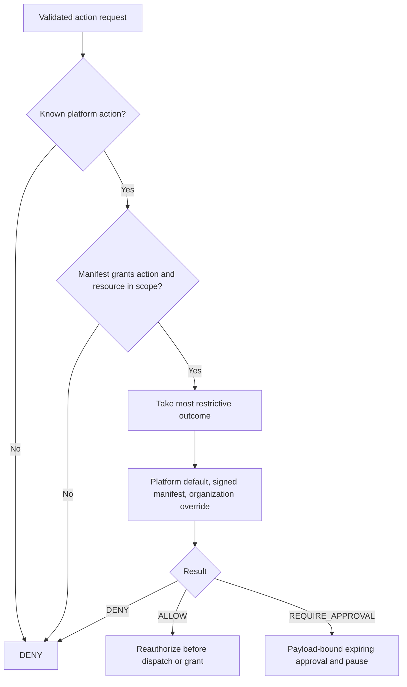

# Policy precedence and human approvals

**Audience:** Administrators, security reviewers, developers. **Implementation status:** Implemented.

**Prerequisites:** Read the platform overview and have access to the relevant organization or source checkout.

Policy is deterministic TypeScript, not an LLM judgment. First validate workload/lease, subject/manifest, pinned bundle/tool version, action declaration, payload digest and connector/resource scope. Missing/invalid prerequisites deny before policy evaluation.

Outcome order is ALLOW < REQUIRE_APPROVAL < DENY. Organization overrides accept only REQUIRE_APPROVAL or DENY and cannot weaken platform defaults. Unknown actions are CRITICAL/DENY. Out-of-scope resources and missing manifest capabilities deny. The policy decision identifies `agents-foundry.foundation` / `foundation-v2`; issued manifests currently retain the separately named `foundation-approval-v1` issuance version.

| Platform action | Default | Risk |
| --- | --- | --- |
| repository.read, repository.write, jira.read, qa.plan | ALLOW | LOW |
| workspace.command, workspace.dependencies.install | ALLOW | MEDIUM |
| qa.execute_playwright, jira.issue.create | REQUIRE_APPROVAL | MEDIUM |
| repository.pull_request.create | REQUIRE_APPROVAL | HIGH |
| production.deploy and unknown actions | DENY | CRITICAL |

## Approval lifecycle

An approval-required action persists its decision and a server-written summary, binds the exact canonical input digest, and pauses the run/step in one transaction. An organization admin can approve or reject; self-approval and repeated decisions fail. The runtime cannot decide its own approval or requeue itself.

Approval TTL by risk: LOW/MEDIUM 24 hours; HIGH eight hours; CRITICAL one hour (the production action still denies). Expired pending approvals become expired and cancel the run. An approved action is checked again for expiry, current policy, connection/secret, ownership and unchanged payload before execution. Approval is not a permanent permission or a reusable token.

Admin approval requeues the run with APPROVAL_GRANTED and the paused step with PENDING; rejection cancels it. Single-use dispatch/grant records prevent repeated effects. Unknown connector-write outcomes lock further matching writes until manual reconciliation.

## Audit and fail-closed behavior

Decisions, human actions, grants, credential issues and reconciliations are audited without raw secrets. Policy unavailable, missing secret, expired grant/approval, wrong tenant/lease, invalid manifest or changed change-set refuse execution. Inspect actual error codes in the [API reference](../api/README.md); never solve a refusal by broadening the agent's prompt.

## Source provenance

Reviewed against platform commit `d2bc8d7fa3fc185cc4f487bdaa1f11611844763f`. These references support the behavior described; types alone are not evidence that a capability executes.

- [packages/policy-engine/src/index.ts](https://github.com/Agents-Foundry/employee-agent-platform/blob/d2bc8d7fa3fc185cc4f487bdaa1f11611844763f/packages/policy-engine/src/index.ts)
- [apps/control-plane-api/src/actions/action-policy-service.ts](https://github.com/Agents-Foundry/employee-agent-platform/blob/d2bc8d7fa3fc185cc4f487bdaa1f11611844763f/apps/control-plane-api/src/actions/action-policy-service.ts)
- [apps/control-plane-api/src/actions/action-gateway.ts](https://github.com/Agents-Foundry/employee-agent-platform/blob/d2bc8d7fa3fc185cc4f487bdaa1f11611844763f/apps/control-plane-api/src/actions/action-gateway.ts)
- [apps/control-plane-api/src/database.ts](https://github.com/Agents-Foundry/employee-agent-platform/blob/d2bc8d7fa3fc185cc4f487bdaa1f11611844763f/apps/control-plane-api/src/database.ts)
- [apps/control-plane-api/test/action-gateway.spec.ts](https://github.com/Agents-Foundry/employee-agent-platform/blob/d2bc8d7fa3fc185cc4f487bdaa1f11611844763f/apps/control-plane-api/test/action-gateway.spec.ts)

## Related documentation

[Documentation index](../README.md) · [Implementation status](../reference/implementation-status.md)
