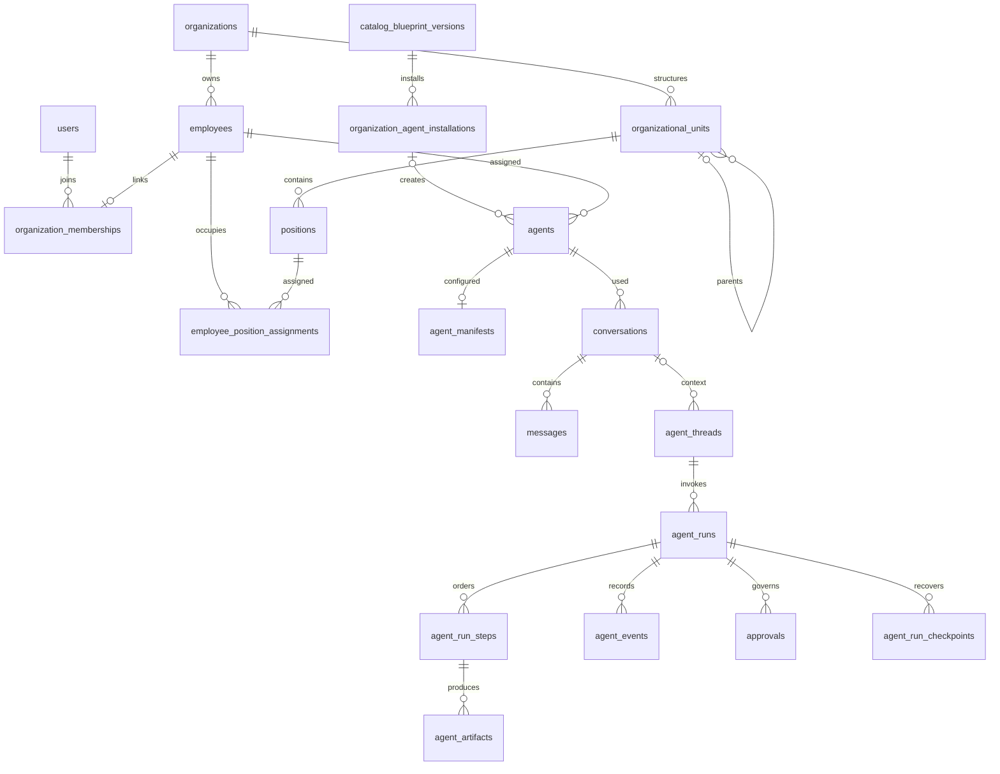

# Domain ownership and relationships

**Audience:** Architects, developers, security reviewers. **Implementation status:** Implemented.

**Prerequisites:** Read the platform overview and have access to the relevant organization or source checkout.

The domain consists of tenant identity/structure, immutable catalog resolution, assigned agent configuration and governed execution. Confirmed entities below map to actual contracts and persistence; separate Department/Team, MCP installation and generalized Permission entities are not invented.

Employee-to-agent ownership is mediated by assignments and the manifest employee_id; the agents table itself has no employee_id column. The diagram is a conceptual relationship view; optional links and uniqueness are specified by the [physical schema](../data-model/schema.md). For example, current agent installations are optional on agents, conversation/thread linking is optional, and composite tenant foreign keys constrain ownership.

## Entity contract, lifecycle and authorization

| Entity | Purpose / important fields | Lifecycle | API / persistence / authorization |
| --- | --- | --- | --- |
| Organization | name/slug/code/profile/version | active, suspended, disabled | organization profile API; organizations; admin writes, session tenant |
| User / identity | global userId; issuer/subject; employee link | user active/disabled, issuer enablement | auth session/membership APIs; users/identities; authentication platform scope |
| Employee | organizationId, optional userId, employment fields | active/inactive | employee API; employees; tenant-admin writes |
| Membership | userId/employeeId/securityRole/version | pending, active, suspended | membership/switch/link APIs; organization_memberships; live access checks |
| Department / Team | OrganizationUnit with unitType/parent/headPositionId | active/archived | unit API; organizational_units; tenant admin |
| Job family/discipline/role/level | tenant code/name/references/rank/version | active/archived | jobs kinds API; job_families/job_disciplines/roles/job_levels; not security access |
| Position / assignment | unit/role/level/reporting references; startedAt/endedAt | active/archived position; dated assignment | jobs/position API; positions/employee_position_assignments; tenant admin |
| Blueprint version | exact dependencies, questionnaire and digest | immutable registered version | catalog bundle API; catalog_blueprint_versions; global read, startup registration |
| Installation | blueprint id/version/digest, scoped configuration/version | ACTIVE/RETIRED | installation API; organization_agent_installations; tenant admin |
| Agent instance | employeeId, blueprint and installation references | ACTIVE/DISABLED | assigned agent/provisioning APIs; agents/agent_assignments; same-tenant active assignment |
| Manifest | signed subject, model, capabilities and configuration | immutable issued snapshot | agent manifest/key APIs; agent_manifests; owning employee/admin retrieval with verification |
| Conversation / message | employee/agent, title; author/content | recorded central conversation | conversation APIs; conversations/messages; private to owning employee |
| Thread | employee/agent, optional conversation, title | ACTIVE/ARCHIVED | execution thread API; agent_threads; owning employee |
| AgentRun | task, manifest ref, runtimeProfile, status/reason | QUEUED/RUNNING/WAITING_FOR_APPROVAL/terminal | execution run API; agent_runs; owner starts/cancels, admin sees governance |
| RunStep | sequence/kind/title/status/detail | pending/running/approval/terminal step states | run detail/protocol; agent_run_steps; current workload writes via validated events |
| AgentEvent | source/type/sequence/payload/correlation | append-only | own run event pages; agent_events; employee privacy, workload/control-plane event authority |
| Policy | platform decision and tenant tightening override | current decision, versioned override | action-policies API; organization_action_policies; deterministic engine and admin |
| Approval | action/risk/resource/expiry/decision and exact input | PENDING/APPROVED/REJECTED/EXPIRED read model | approvals API; approvals; same-tenant admin, no self-approval |
| Action request / execution | digest/parameters/policy and dispatch/result | recorded request; dispatch closes once | signed actions transport; agent_action_requests/executions; current workload lease |
| Execution grant | signed payload/digest/limits/correlation/expiry | issued and single-use | grant transport; agent_execution_grants and execution-local grant state; verified operation only |
| Artifact | type/MIME/name/size/checksum/retention | immutable registration; object lifecycle separate | run detail/retrieval APIs; agent_artifacts/agent_artifact_objects; owner/admin short-lived retrieval |
| Secret reference | secret:// name and tenant/provider | active binding, replacement/disable | connection/model APIs; reference columns only; broker reveals at point of use |
| Credential lease | connection/repository/grant/digest/expiry | ISSUED/REDEEMED/RELEASED/REVOKED/EXPIRED | lease admin and execution redeem/release; repository_credential_leases; execution workload role |
| Checkpoint / runtime lease | version/hash/body/binding; runtime/session/liveness | ordered latest versions, terminal cleanup; ACTIVE/CLOSED lease | signed checkpoint/heartbeat; agent_run_checkpoints/leases; current session only |
| Workspace | organization/employee/agent/thread/provider/repositories | PROVISIONING/READY/IN_USE/SUSPENDED/LOST/DESTROYED contract | execution-local SQLite/filesystem; granted subject and thread ownership |
| Skill / tool / workflow | versioned declarative definitions and requirements | immutable catalog-pinned data | bundle API; stored within catalog JSON; runtime tool registry separate |
| Model | profile/provider/model and spending usage | per-call reservation/settlement | model credential/budget/usage APIs; model budget/price/reservation records; no independent model inventory service |
| Audit/change event | actor/type/resource/metadata or before/after | audit append via application; protected streams differ | lifecycle/administration records; audit_events/organization_change_events; no unrestricted audit CRUD API |

Detailed field declarations and response representations are extracted in [wire contracts](../api/contracts.md); physical fields, indexes, constraints and source SQL are in the schema dictionary. Use those together with route/service authorization, not a conceptual ER diagram as a complete SQL contract.

## Implementation Status / Architecture Gap

No MCP installation/tool/connection entity or standalone skill-execution persistence exists. Memory/knowledge profiles are configuration, not backing retrieval services. `ApprovalRequest`'s legacy type has fewer states than the newer run approval summary, which includes EXPIRED; this contract drift is recorded as an engineering follow-up.

## Source provenance

Reviewed against platform commit `d2bc8d7fa3fc185cc4f487bdaa1f11611844763f`. These references support the behavior described; types alone are not evidence that a capability executes.

- [packages/contracts/src/index.ts](https://github.com/Agents-Foundry/employee-agent-platform/blob/d2bc8d7fa3fc185cc4f487bdaa1f11611844763f/packages/contracts/src/index.ts)
- [packages/contracts/src/tenancy.ts](https://github.com/Agents-Foundry/employee-agent-platform/blob/d2bc8d7fa3fc185cc4f487bdaa1f11611844763f/packages/contracts/src/tenancy.ts)
- [packages/contracts/src/catalog.ts](https://github.com/Agents-Foundry/employee-agent-platform/blob/d2bc8d7fa3fc185cc4f487bdaa1f11611844763f/packages/contracts/src/catalog.ts)
- [packages/contracts/src/execution.ts](https://github.com/Agents-Foundry/employee-agent-platform/blob/d2bc8d7fa3fc185cc4f487bdaa1f11611844763f/packages/contracts/src/execution.ts)
- [packages/contracts/src/artifacts.ts](https://github.com/Agents-Foundry/employee-agent-platform/blob/d2bc8d7fa3fc185cc4f487bdaa1f11611844763f/packages/contracts/src/artifacts.ts)
- [apps/control-plane-api/src/db/migrations/0001-baseline.ts](https://github.com/Agents-Foundry/employee-agent-platform/blob/d2bc8d7fa3fc185cc4f487bdaa1f11611844763f/apps/control-plane-api/src/db/migrations/0001-baseline.ts)
- [apps/execution-runtime/src/state-store.ts](https://github.com/Agents-Foundry/employee-agent-platform/blob/d2bc8d7fa3fc185cc4f487bdaa1f11611844763f/apps/execution-runtime/src/state-store.ts)

## Related documentation

[Documentation index](../README.md) · [Implementation status](../reference/implementation-status.md)
