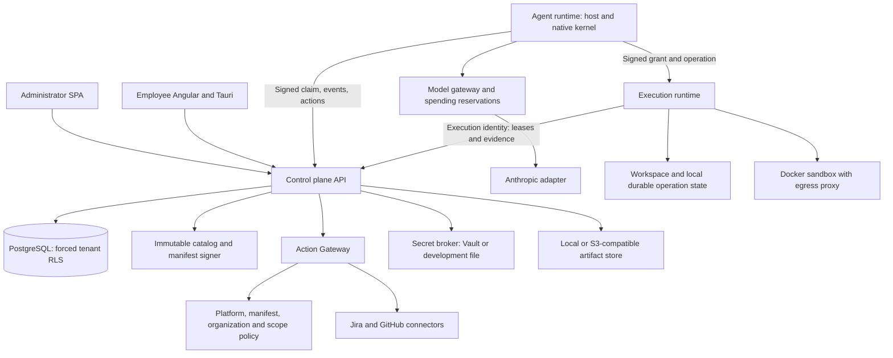

# Platform architecture

**Audience:** Architects, developers, operators. **Implementation status:** Implemented.

**Prerequisites:** Read the platform overview and have access to the relevant organization or source checkout.

Agents Foundry assigns declarative employee agents within an organization and governs their work through a central control plane. Agent reasoning and potentially dangerous execution run in separate processes. A role definition configures these shared mechanisms; it does not bypass them.

## Responsibilities

The control plane authenticates people, resolves their organization, verifies assignment, signs manifests, persists threads/runs/steps/events, decides policy, records approvals, authorizes side effects, brokers secrets and stores verified evidence. It owns authorization even when another process executes the operation.

The agent runtime polls signed workload commands and verifies the manifest against a pinned public key. `NativeKernel` manages bounded model/tool turns. The model gateway resolves an organization credential, reserves spending, calls an adapter and settles reported usage. Tools use the gateway or signed execution grants.

The execution runtime verifies the grant signature, expiry, payload digest and workspace ownership. It consumes each grant once, persists operation outcomes locally, and either performs constrained host operations or runs repository code in a Docker sandbox. Its SQLite state is distinct from the control plane's PostgreSQL.

## Operational boundary

Implemented does not mean enabled: new v2 issuance and generic/QA runtime paths have separate default-off flags. Only Anthropic is a live model adapter; the optional scripted provider supports deterministic tests. MCP and memory profile fields are declarative, without a corresponding client or memory provider.

The API entrypoint binds `127.0.0.1`. There are no Kubernetes, GKE, Helm, Terraform or product Docker Compose deployment manifests in this revision. A production deployment must supply its own process supervision, reverse proxy, TLS, database, secret store and artifact storage configuration.

## Reading historical architecture

Earlier product documents at this same commit contain Phase A/C descriptions that lag the implementation. This repository uses current code, migration registry and tests as the baseline; original decisions remain available in [ADRs](../adr/README.md). See [architecture gaps](../roadmap/architecture-gaps.md) for unresolved capabilities.

## Source provenance

Reviewed against platform commit `d2bc8d7fa3fc185cc4f487bdaa1f11611844763f`. These references support the behavior described; types alone are not evidence that a capability executes.

- [apps/control-plane-api/src/database.ts](https://github.com/Agents-Foundry/employee-agent-platform/blob/d2bc8d7fa3fc185cc4f487bdaa1f11611844763f/apps/control-plane-api/src/database.ts)
- [apps/agent-runtime/src/main.ts](https://github.com/Agents-Foundry/employee-agent-platform/blob/d2bc8d7fa3fc185cc4f487bdaa1f11611844763f/apps/agent-runtime/src/main.ts)
- [apps/execution-runtime/src/main.ts](https://github.com/Agents-Foundry/employee-agent-platform/blob/d2bc8d7fa3fc185cc4f487bdaa1f11611844763f/apps/execution-runtime/src/main.ts)
- [packages/catalog/src/index.ts](https://github.com/Agents-Foundry/employee-agent-platform/blob/d2bc8d7fa3fc185cc4f487bdaa1f11611844763f/packages/catalog/src/index.ts)

## Related documentation

[Documentation index](../README.md) · [Implementation status](../reference/implementation-status.md)
