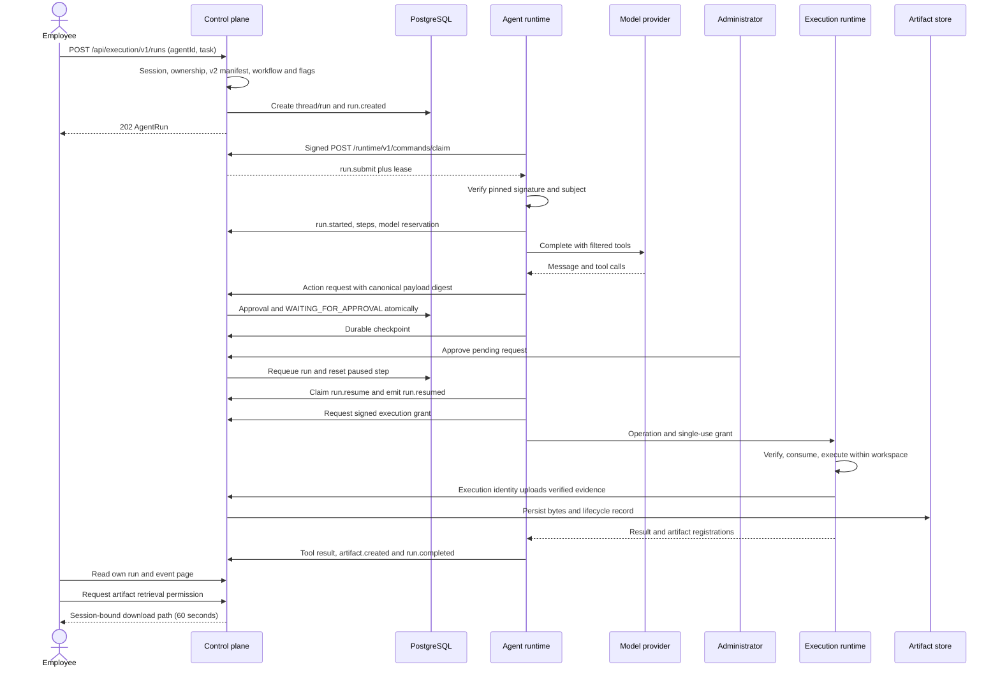

# Request and evidence lifecycle

**Audience:** Architects, developers, QA. **Implementation status:** Implemented.

**Prerequisites:** Read the platform overview and have access to the relevant organization or source checkout.

The generic path begins with an assigned v2 agent and an authenticated employee. A task is one run inside a durable thread. Browser-facing routes and workload routes use separate authentication mechanisms.

For a connector action such as `jira.issue.create`, the runtime uses `/runtime/v1/actions/execute` after approval; the control plane invokes the connector directly. There is no execution grant for that connector call. Reads can be allowed without a human approval, but still pass assignment, digest, scope and policy checks.

## Failure and cancellation

A rejection cancels the paused run. Unanswered expired approvals cancel it with `APPROVAL_EXPIRED`. An owning employee can cancel via `/api/execution/v1/runs/:id/cancel`. Invalid transitions and events after a terminal state are refused. Durable recovery reuses the prior request identifiers; it does not grant permission to repeat an external write with an unknown outcome.

## Legacy QA compatibility

`POST /api/qa/runs` remains supported. With eligible v2 agents and `QA_GENERIC_RUNTIME_ENABLED=true` it queues the generic `validate-story` workflow; otherwise it follows the legacy planned-QA/approval path. Legacy `READY` is not equivalent to generic `COMPLETED`. See [QA workflow](../use-cases/qa-engineer.md).

## Source provenance

Reviewed against platform commit `9e7ec4eba0eeddb0fdb86c18740a1c1a610146a4`. These references support the behavior described; types alone are not evidence that a capability executes.

- [apps/control-plane-api/src/execution/execution-routes.ts](https://github.com/Agents-Foundry/employee-agent-platform/blob/9e7ec4eba0eeddb0fdb86c18740a1c1a610146a4/apps/control-plane-api/src/execution/execution-routes.ts)
- [apps/control-plane-api/src/runtime/runtime-transport-service.ts](https://github.com/Agents-Foundry/employee-agent-platform/blob/9e7ec4eba0eeddb0fdb86c18740a1c1a610146a4/apps/control-plane-api/src/runtime/runtime-transport-service.ts)
- [apps/agent-runtime/src/kernel/native-kernel.ts](https://github.com/Agents-Foundry/employee-agent-platform/blob/9e7ec4eba0eeddb0fdb86c18740a1c1a610146a4/apps/agent-runtime/src/kernel/native-kernel.ts)
- [apps/control-plane-api/src/actions/action-gateway.ts](https://github.com/Agents-Foundry/employee-agent-platform/blob/9e7ec4eba0eeddb0fdb86c18740a1c1a610146a4/apps/control-plane-api/src/actions/action-gateway.ts)
- [apps/execution-runtime/src/execution-service.ts](https://github.com/Agents-Foundry/employee-agent-platform/blob/9e7ec4eba0eeddb0fdb86c18740a1c1a610146a4/apps/execution-runtime/src/execution-service.ts)

## Related documentation

[Documentation index](../README.md) · [Implementation status](../reference/implementation-status.md)
