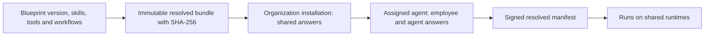

# Blueprints, installations and assigned agents

**Audience:** Administrators, developers, partners. **Implementation status:** Implemented.

**Prerequisites:** Read the platform overview and have access to the relevant organization or source checkout.

The runtime does not execute a marketing role name. It executes a signed manifest resolved from a registered role bundle and an employee assignment.

An `AgentBlueprintVersionDefinition` is global catalog data. Registration validates schemas, exact dependency versions and consistency, then stores a digest-pinned immutable bundle. Altering an existing version fails startup with `CATALOG_VERSION_MUTATED`. A supported stored version stays resolvable after it stops shipping; unsupported bundle schemas fail closed.

An organization installation holds only `INSTALLATION` questionnaire answers. Agent creation supplies only `AGENT` answers. Active names are unique case-insensitively within a tenant. Installation updates use `version`; retirement is final. Changes affect subsequent agents and never mutate already issued manifests.

An assigned instance is stored in `agents` and associated with an employee. Admin batch creation accepts one to 25 distinct active employees and a UUID idempotency key. Successful replay returns the original result; changed content conflicts. Each instance receives its own immutable signed manifest.

Five role identities are shipped: QA Engineer (1.1.0 and 1.2.0), Frontend Engineer (1.0.0 and 1.1.0), Backend Engineer (1.0.0), Code Reviewer (1.0.0), and Test Automation Engineer (1.0.0). This is seven blueprint versions, not seven departments. Refer to the catalog API for the exact bundle and configured tools at a version.

Skills and workflows supply declarative guidance. Runtime tools require actual registered implementations. A new role using existing capabilities is data-only; a new tool/action/connector requires implementation and policy support. External role-package loading and publishing are planned.

## Source provenance

Reviewed against platform commit `d2bc8d7fa3fc185cc4f487bdaa1f11611844763f`. These references support the behavior described; types alone are not evidence that a capability executes.

- [packages/catalog/src/index.ts](https://github.com/Agents-Foundry/employee-agent-platform/blob/d2bc8d7fa3fc185cc4f487bdaa1f11611844763f/packages/catalog/src/index.ts)
- [packages/contracts/src/catalog.ts](https://github.com/Agents-Foundry/employee-agent-platform/blob/d2bc8d7fa3fc185cc4f487bdaa1f11611844763f/packages/contracts/src/catalog.ts)
- [apps/control-plane-api/src/catalog/catalog-registry.ts](https://github.com/Agents-Foundry/employee-agent-platform/blob/d2bc8d7fa3fc185cc4f487bdaa1f11611844763f/apps/control-plane-api/src/catalog/catalog-registry.ts)
- [apps/control-plane-api/src/catalog/installation-service.ts](https://github.com/Agents-Foundry/employee-agent-platform/blob/d2bc8d7fa3fc185cc4f487bdaa1f11611844763f/apps/control-plane-api/src/catalog/installation-service.ts)
- [apps/control-plane-api/src/agents/manifest-v2.ts](https://github.com/Agents-Foundry/employee-agent-platform/blob/d2bc8d7fa3fc185cc4f487bdaa1f11611844763f/apps/control-plane-api/src/agents/manifest-v2.ts)

## Related documentation

[Documentation index](../README.md) · [Implementation status](../reference/implementation-status.md)
