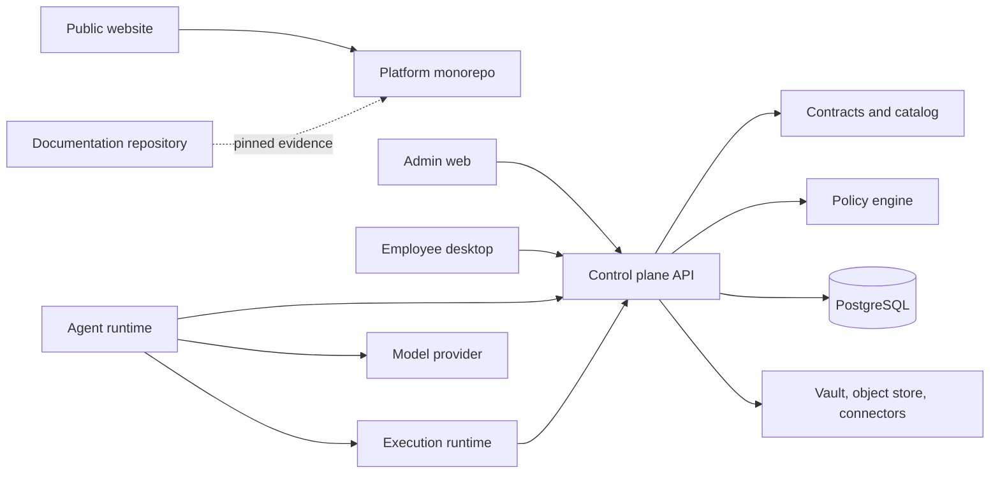

# Repository and component map

**Audience:** All readers. **Implementation status:** Implemented.

**Prerequisites:** Read the platform overview and have access to the relevant organization or source checkout.

Inventory of the GitHub organization: three active repositories, inspected on 2026-10-07. The architectural boundaries are primarily **directories in one monorepo**, not separate runtime or role repositories.

| Repository | Responsibility / layer | Technology | Dependencies | Status |
| --- | --- | --- | --- | --- |
| [employee-agent-platform](https://github.com/Agents-Foundry/employee-agent-platform) | Product implementation: control plane, agent runtime, execution runtime, roles | TypeScript, Angular 22, Express 5, PostgreSQL 16, Rust/Tauri 2 | npm workspaces, Docker for sandbox/tests, external model and connector services | Implemented; capability limits in the status matrix |
| [employee-agent-website](https://github.com/Agents-Foundry/employee-agent-website) | Public product marketing; no authorization authority | Static HTML/CSS/JS build, Node 24, jsdom | GitHub Pages workflow; links to platform | Implemented; inspected `4cc111021cf60b5a4b676a26659fbc51431a5ef3` |
| [employee-agent-platform-docs](https://github.com/Agents-Foundry/employee-agent-platform-docs) | Technical documentation, GitHub Pages website and drift checks | Markdown, Mermaid, JSON examples, Node tooling | Pinned product source inventory | Public repository; Pages deploys validated site builds |

| Product directory | Responsibility | Direct dependencies / trust |
| --- | --- | --- |
| `apps/control-plane-api` | Authentication, tenancy, catalog, manifests, runs, approvals, grants, credentials, artifacts, spending | contracts, policy-engine, catalog, telemetry, PostgreSQL, brokered services |
| `apps/control-plane-web` | Organization administrator SPA | API, contracts, web-auth |
| `apps/employee-desktop` | Employee Angular workspace and Tauri shell | API, contracts, web-auth; no desktop-local agent runtime |
| `apps/agent-runtime` | Polling host, native kernel, model gateway, tools, checkpoints | Signed control-plane transport; optional execution runtime; Anthropic |
| `apps/execution-runtime` | Signed-grant operations and workspace evidence | Local SQLite state, git, Docker/npm/Playwright, control-plane credential/evidence transport |
| `packages/contracts` | Domain types and strict Node schemas | zod for validators; pure type exports for browsers |
| `packages/catalog` | Five engineering roles, pinned skills/tools/workflows, evaluations | contracts; no executable role code |
| `packages/policy-engine` | Deterministic fail-closed decisions | Pure TypeScript |
| `packages/web-auth` | Shared sign-in/session/account-switch UI | Angular and API |
| `packages/telemetry` | Closed-attribute traces, metrics and exporters | Node process hosts |
| `packages/readiness` | Evidence-derived pilot assessment | Assessment JSON and Vitest results |

Packages have no independent `package.json`; `tsconfig.json` paths and relative imports connect them. The three backend processes are npm workspaces.

The website was inspected through `package.json`, `public-build.mjs`, `site-config.mjs`, `README.md`, and `.github/workflows/pages.yml`. Its Pages publishing pipeline does not deploy the platform or this private documentation repository.

## Source provenance

Reviewed against platform commit `d2bc8d7fa3fc185cc4f487bdaa1f11611844763f`. These references support the behavior described; types alone are not evidence that a capability executes.

- [package.json](https://github.com/Agents-Foundry/employee-agent-platform/blob/d2bc8d7fa3fc185cc4f487bdaa1f11611844763f/package.json)
- [tsconfig.json](https://github.com/Agents-Foundry/employee-agent-platform/blob/d2bc8d7fa3fc185cc4f487bdaa1f11611844763f/tsconfig.json)
- [.github/workflows/ci.yml](https://github.com/Agents-Foundry/employee-agent-platform/blob/d2bc8d7fa3fc185cc4f487bdaa1f11611844763f/.github/workflows/ci.yml)

## Related documentation

[Documentation index](../README.md) · [Implementation status](implementation-status.md)
