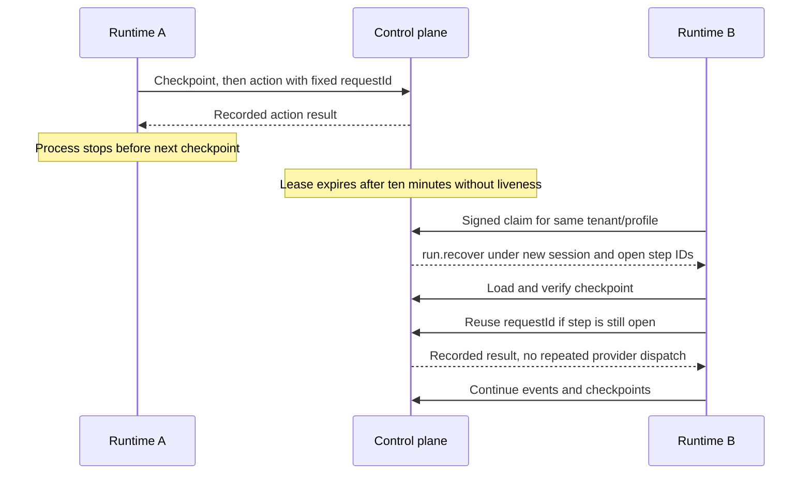

# Durable checkpoints, leases and retry safety

**Audience:** Runtime developers, operators. **Implementation status:** Implemented.

**Prerequisites:** Read the platform overview and have access to the relevant organization or source checkout.

Control-plane checkpoints are the default. They bind tenant/thread/run, lease session, manifest ID/digest, workflow, in-flight step/approval, kernel and runtime event sequence. The body has a SHA-256 and a strictly increasing version; only the latest two versions are retained, and terminal runs delete them. Browsers cannot retrieve checkpoint bodies.

The kernel checkpoints at start, after every model turn, before a tool call and after each result. Step/tool-call/action request IDs are fixed before the side effect. A resumed runtime reuses them to obtain recorded decisions/results/grants rather than issuing another effect. If a step finished but its result was not saved, the tool is not repeated; the model receives TOOL_OUTCOME_UNKNOWN.

Events, checkpoints and heartbeats renew a ten-minute lease. Agent heartbeats default to 30 seconds; an undelivered command can be redelivered after 60 seconds. Takeover invalidates the previous session. A missing/corrupt/mismatched checkpoint fails closed; a stale version or session stops the old worker without recording misleading progress.

The reaper runs at runtime polling and each API minute. Abandoned runs without a durable checkpoint are cancelled, abandoned work not picked up within 24 hours is cancelled, and three prior handovers bound further recovery. An approved queued run receives run.resume rather than a second run.started.

## Limits

Recovery can take ten minutes after last liveness. A model call lost before checkpointing may be made again; its first reservation remains counted. An expired grant is not reissued as if fresh. A connector write with unknown effect requires manual reconciliation. File checkpoints are development-only and cannot support another host resuming the same run. Bodies contain conversation content and rely on database encryption at rest, not application encryption.

## Source provenance

Reviewed against platform commit `d2bc8d7fa3fc185cc4f487bdaa1f11611844763f`. These references support the behavior described; types alone are not evidence that a capability executes.

- [apps/agent-runtime/src/checkpoints.ts](https://github.com/Agents-Foundry/employee-agent-platform/blob/d2bc8d7fa3fc185cc4f487bdaa1f11611844763f/apps/agent-runtime/src/checkpoints.ts)
- [apps/agent-runtime/src/kernel/native-kernel.ts](https://github.com/Agents-Foundry/employee-agent-platform/blob/d2bc8d7fa3fc185cc4f487bdaa1f11611844763f/apps/agent-runtime/src/kernel/native-kernel.ts)
- [apps/control-plane-api/src/runtime/run-checkpoints.ts](https://github.com/Agents-Foundry/employee-agent-platform/blob/d2bc8d7fa3fc185cc4f487bdaa1f11611844763f/apps/control-plane-api/src/runtime/run-checkpoints.ts)
- [apps/control-plane-api/src/runtime/runtime-transport-service.ts](https://github.com/Agents-Foundry/employee-agent-platform/blob/d2bc8d7fa3fc185cc4f487bdaa1f11611844763f/apps/control-plane-api/src/runtime/runtime-transport-service.ts)
- [apps/control-plane-api/test/run-recovery-e2e.spec.ts](https://github.com/Agents-Foundry/employee-agent-platform/blob/d2bc8d7fa3fc185cc4f487bdaa1f11611844763f/apps/control-plane-api/test/run-recovery-e2e.spec.ts)

## Related documentation

[Documentation index](../README.md) · [Implementation status](../reference/implementation-status.md)
