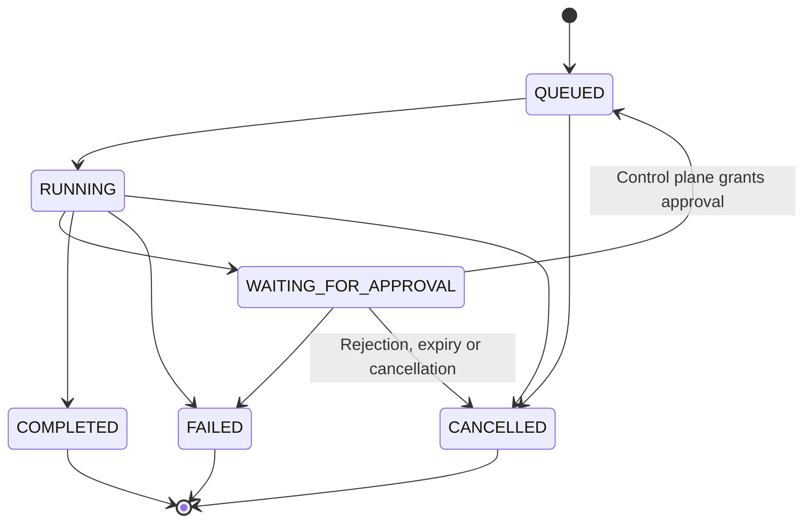

# Threads, runs, steps and event transitions

**Audience:** Runtime developers, QA, operators. **Implementation status:** Implemented.

**Prerequisites:** Read the platform overview and have access to the relevant organization or source checkout.

`Thread` is durable work context (`ACTIVE` or `ARCHIVED`). `AgentRun` is a single task invocation under that context. A run pins a manifest reference and runtime profile; a legacy QA run can link through `legacyQaRunId`. `RunStep` records ordered logical work (`PLAN`, `MODEL`, `TOOL`, `ACTION`, `MESSAGE`). `AgentEvent` is append-only history with a per-run monotonically increasing sequence.

This diagram is the `runTransitions` matrix. Event-specific guards narrow it further: `run.started` requires a fresh QUEUED run with null reason; `run.resumed` requires QUEUED with `APPROVAL_GRANTED`. A runtime cannot release a WAITING_FOR_APPROVAL run itself. `run.failed` cannot move QUEUED directly to FAILED through this matrix.

| Step state | Permitted next states |
| --- | --- |
| PENDING | RUNNING, WAITING_FOR_APPROVAL, SKIPPED, CANCELLED |
| RUNNING | WAITING_FOR_APPROVAL, COMPLETED, FAILED, CANCELLED |
| WAITING_FOR_APPROVAL | PENDING, FAILED, CANCELLED |
| COMPLETED, FAILED, SKIPPED, CANCELLED | None |

Human approval resets the step to PENDING and requeues the run. The runtime resumes the checkpointed tool call with the same identifiers. Never add a fictitious `APPROVED`, `RETRYING` or `PAUSED` run status: PAUSED is a kernel outcome, while the persisted status is WAITING_FOR_APPROVAL.

## Event access and authority

The control plane alone records `run.created`, `user.message` and approval requested/approved/rejected/expired events. The signed protocol accepts only its runtime event allow-list and validates event payloads, correlation, sequence and current lease. Runtime event acknowledgments distinguish a duplicate from a new insert.

Owning employees can read their thread, run and event history. Organization admins can inspect run/approval/artifact governance data but do not receive employee event history or conversation content through the event endpoint. Cross-tenant and wrong-owner resources return 404.

## Source provenance

Reviewed against platform commit `d2bc8d7fa3fc185cc4f487bdaa1f11611844763f`. These references support the behavior described; types alone are not evidence that a capability executes.

- [packages/contracts/src/execution.ts](https://github.com/Agents-Foundry/employee-agent-platform/blob/d2bc8d7fa3fc185cc4f487bdaa1f11611844763f/packages/contracts/src/execution.ts)
- [packages/contracts/src/run-lifecycle.ts](https://github.com/Agents-Foundry/employee-agent-platform/blob/d2bc8d7fa3fc185cc4f487bdaa1f11611844763f/packages/contracts/src/run-lifecycle.ts)
- [apps/control-plane-api/src/execution/execution-service.ts](https://github.com/Agents-Foundry/employee-agent-platform/blob/d2bc8d7fa3fc185cc4f487bdaa1f11611844763f/apps/control-plane-api/src/execution/execution-service.ts)

## Related documentation

[Documentation index](../README.md) · [Implementation status](../reference/implementation-status.md)
