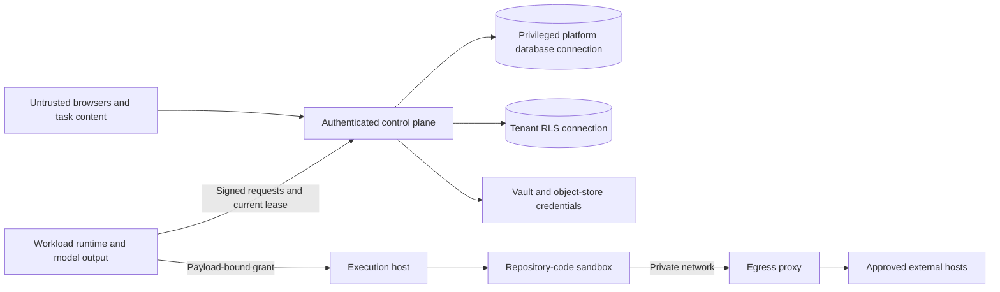

# Threat model and control coverage

**Audience:** Security reviewers, architects, operators. **Implementation status:** Partially Implemented.

**Prerequisites:** Read the platform overview and have access to the relevant organization or source checkout.

This is a source-derived STRIDE assessment, not a penetration-test result or compliance certification. Assets include organization data, credentials, signed authorization, model budget, employee conversation/checkpoint content, workspaces and evidence. Potential adversaries include unauthenticated callers, another tenant's member, a malicious employee, compromised model/tool output, malicious repository content and compromised workloads.

| STRIDE / threat | Attack surface and impact | Implemented control | Residual risk / validation |
| --- | --- | --- | --- |
| Spoofing people | Forged headers or stolen sessions gain another employee's work | Google OIDC or password sessions; live memberships; HttpOnly cookies; demo blocked in production | Demo is forgeable locally; no MFA implementation; review session expiry and TLS deployment |
| Spoofing workloads | Forged runtime emits events or requests credentials | Ed25519 signature over method/path/time/nonce/body; persistent nonce replay refusal; agent/execution roles and tenant/profile restrictions | Protect private key files; no automated workload key rotation workflow |
| Tampering manifests | Model or caller elevates tools or tenant | Canonical Ed25519 signed payload; pinned SPKI key, subject validation, exact catalog digest | Public-key distribution and rotation are operational; signature does not attest catalog quality |
| Tampering evidence | Producer substitutes trace/report content or traverses paths | Hash/size validation, controlled object keys, immutable registrations, download verification | 128 MiB buffered reads; storage encryption and backup are deployment responsibilities |
| Repudiation | An actor denies an approval, side effect or change | Audit events, immutable organization change stream, append-only run events; payload-bound single-use decisions | No shipped SIEM export or external immutable retention; validate audit privileges |
| Information disclosure across tenants | Missing tenant filter, wrong owner or cache leak | Forced RLS for tenant tables, composite keys, owner checks; cache invalidation notifications | Platform connection bypasses RLS; require review of every platform-scoped query |
| Credential exfiltration | Repository/model reads provider or connector secrets | secret references; reveal at dispatch; execution-only single-use checkout leases; scrubbed subprocess environment; no credentials in checkpoints | Runtime receives live model key in memory; development secret file is plaintext; audit integration-specific errors |
| Prompt injection | Story/repository/tool output instructs unauthorized execution | Model output never grants permission; tools filtered; deterministic policy, exact resource/payload checks and human approvals | No content sanitizer or complete semantic injection defense; review approved payloads and restrict target scopes |
| SSRF / network exfiltration | Browser or code contacts metadata or unapproved hosts | Container internal network and allow-list proxy; DNS address checks; constrained git egress, redirects refused | Host operations and control-plane connectors are separate surfaces; private address/DNS behavior must be tested for deployment |
| Elevation through repository code | npm or Playwright reads host files or obtains privileges | Nonprivileged sandbox, capabilities dropped, read-only root, workspace-only mount, CPU/memory/PID/time limits | Docker engine and execution host are trusted; checkout remains on host; dedicate hosts per pilot organization |
| Denial of service | Runaway models, processes, body sizes, telemetry cardinality | Turn caps, budgets, JSON/upload limits, rate limits, process timeouts, resource limits, bounded metrics | No tested tenant admission control; concurrent large artifact reads require memory sizing |
| Duplicate external writes | Crash/retry republishes Jira issue or PR | Persisted single-use executions, unknown-outcome lock and manual reconciliation | No provider-side idempotency key; write may have happened despite failed response |

## Review and proof

Run tenant/RLS, runtime-transport, action-gateway, credentials, egress, durable-artifact and failure-drill suites. Tests using simulated Vault, S3 and collectors do not prove live infrastructure. Before a pilot, resolve secrets and upload/retrieve/expire evidence against the actual services, verify a complete trace and test denied egress.

No shipped SOC 2/ISO certification, penetration-test attestation, encrypted checkpoint body, dashboard pack or production IaC was found. Track these as engineering or deployment work; documentation cannot manufacture the control.

## Source provenance

Reviewed against platform commit `9e7ec4eba0eeddb0fdb86c18740a1c1a610146a4`. These references support the behavior described; types alone are not evidence that a capability executes.

- [apps/control-plane-api/src/auth.ts](https://github.com/Agents-Foundry/employee-agent-platform/blob/9e7ec4eba0eeddb0fdb86c18740a1c1a610146a4/apps/control-plane-api/src/auth.ts)
- [apps/control-plane-api/src/runtime/runtime-identity.ts](https://github.com/Agents-Foundry/employee-agent-platform/blob/9e7ec4eba0eeddb0fdb86c18740a1c1a610146a4/apps/control-plane-api/src/runtime/runtime-identity.ts)
- [apps/control-plane-api/src/actions/action-gateway.ts](https://github.com/Agents-Foundry/employee-agent-platform/blob/9e7ec4eba0eeddb0fdb86c18740a1c1a610146a4/apps/control-plane-api/src/actions/action-gateway.ts)
- [apps/execution-runtime/src/providers/container-provider.ts](https://github.com/Agents-Foundry/employee-agent-platform/blob/9e7ec4eba0eeddb0fdb86c18740a1c1a610146a4/apps/execution-runtime/src/providers/container-provider.ts)
- [apps/execution-runtime/sandbox/egress-proxy.mjs](https://github.com/Agents-Foundry/employee-agent-platform/blob/9e7ec4eba0eeddb0fdb86c18740a1c1a610146a4/apps/execution-runtime/sandbox/egress-proxy.mjs)
- [packages/telemetry/src/attributes.ts](https://github.com/Agents-Foundry/employee-agent-platform/blob/9e7ec4eba0eeddb0fdb86c18740a1c1a610146a4/packages/telemetry/src/attributes.ts)
- [pilot-readiness/assessment.json](https://github.com/Agents-Foundry/employee-agent-platform/blob/9e7ec4eba0eeddb0fdb86c18740a1c1a610146a4/pilot-readiness/assessment.json)

## Related documentation

[Documentation index](../README.md) · [Implementation status](../reference/implementation-status.md)
